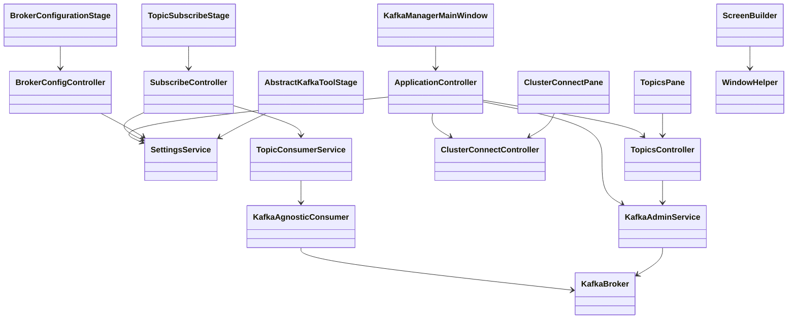

# Kafka Tool — Architecture

Last updated: 2026-06-25

## Overview

Kafka Tool is a single-process JavaFX desktop application using an **MVC-style** layout: views (panes, stages, controls) bind to controllers; controllers orchestrate services in `inspect/`, `consumers/`, and `settings/`. One `KafkaAdminService` instance manages the broker connection for the app lifetime.

```
┌─────────────────────────────────────────────────────────────────────────┐
│ KafkaManagerMainWindow → ApplicationController                          │
│   ClusterConnectPane → ClusterConnectController                         │
│   TopicsPane → TopicsController → TopicSubscribeStage → SubscribeController │
│   BrokerConfigurationStage → BrokerConfigController                     │
└─────────────────────────────────────────────────────────────────────────┘
         │                              │
         ▼                              ▼
   SettingsService → ~/.kafka-tool/     Kafka Cluster + Schema Registry
```

## Technology stack

| Concern | Choice |
|---------|--------|
| Runtime | Java 25 |
| UI | JavaFX 25 (programmatic, undecorated windows) |
| Kafka client | Apache kafka-clients 4.3.x |
| Schema formats | Confluent serializers 8.3.x (Avro, JSON Schema, Protobuf) |
| Config persistence | Jackson JSON files in `~/.kafka-tool/` |
| Logging | SLF4J + Logback |
| Build | Maven |
| Local dev stack | Docker Compose (`resources/docker/docker-compose.yaml`, `./scripts/setup-local-env.sh`) |

## Package structure

### Root (`io.vepo.kafka.tool`)

| Class | Responsibility |
|-------|----------------|
| `KafkaManagerMainWindow` | Application entry; creates `ApplicationController`; scene chrome |
| `ClusterConnectPane` | View: broker combo, configure/connect buttons |
| `TopicsPane` | View: topic list with Empty / Subscribe actions |

### `controllers/` — MVC orchestration

| Class | Responsibility |
|-------|----------------|
| `ApplicationController` | Owns `KafkaAdminService` and `SettingsService`; wires child controllers; connect/shutdown |
| `ClusterConnectController` | Broker list for connect screen; opens broker config |
| `TopicsController` | Topic list state; empty topic; open subscribe stage |
| `SubscribeController` | Consumer lifecycle, message rows, serializer persistence |
| `BrokerConfigController` | Broker CRUD via `SettingsService` |

Controllers may use `javafx.collections` and `Platform.runLater` for FX-thread marshalling. They must not mutate JavaFX nodes directly.

### `viewmodels/` — Presentation models

| Class | Responsibility |
|-------|----------------|
| `MessageRow` | Display key/value + offset for subscribe table |
| `ConsumerState` | IDLE, RUNNING, STOPPED, ERROR |

### `inspect/` — Admin API and domain models

| Class | Responsibility |
|-------|----------------|
| `KafkaAdminService` | Single-thread executor; `AdminClient` lifecycle; list topics, empty topic |
| `TopicInfo` | Topic name + internal flag |
| `KafkaMessage` | Raw key bytes + deserialized value string |
| `MessageMetadata` | Offset metadata from consumer callback |

### `consumers/` — Topic consumption

| Class | Responsibility |
|-------|----------------|
| `KafkaAgnosticConsumer` | Factory + shared poll loop for Avro, JSON, Protobuf |
| `TopicConsumerService` | Serializer mapping, executor, start/stop lifecycle |
| `KeyFormatter` | Key byte → display string |
| `ProtobufHelper` | Protobuf message → JSON |
| `AgnosticConsumerException` | Unchecked wrapper for consumer failures |

### `settings/` — Persistence

| Class | Responsibility |
|-------|----------------|
| `Settings` | Internal static load/save; single-thread `saveExecutor` |
| `SettingsService` | Injectable facade used by controllers (not views) |
| `KafkaSettings` / `KafkaBroker` | Saved broker profiles |
| `UiSettings` / `WindowSettings` | Window dimensions |
| `SerializerSettings` | Per-topic key/value serializer choices |

Config directory: `~/.kafka-tool/`

| File | Content |
|------|---------|
| `kafka-properties.json` | Broker list |
| `ui-properties.json` | Main window + dialog sizes |
| `serializers.json` | Per-topic serializer preferences |

### `stages/` — Secondary window views

| Class | Responsibility |
|-------|----------------|
| `AbstractKafkaToolStage` | Undecorated stage setup, dialog size via `SettingsService` |
| `BrokerConfigurationStage` | Broker table + add form (view only) |
| `TopicSubscribeStage` | Subscribe UI bound to `SubscribeController` |
| `MessageViewerStage` | Read-only formatted message view |

### `controls/` — Reusable UI

| Area | Key types |
|------|-----------|
| Layout | `MainWindowPane`, `CentralizedPane`, `WindowHead`, `TopicConsumerStatusBar` |
| Builders | `ScreenBuilder`, `ResizePolicy` |
| Helpers | `WindowHelper`, `ResizeHelper` |

## Layer rules

| Layer | May call | Must not |
|-------|----------|----------|
| Views (`controls/`, `stages/`, root panes) | `controllers/`, `viewmodels/` | `inspect/`, `consumers/`, `Settings` directly |
| `controllers/` | `inspect/`, `consumers/`, `SettingsService`, `viewmodels/` | JavaFX node mutation; Kafka clients directly |
| `inspect/`, `consumers/`, `settings/` | Kafka, Jackson, filesystem | JavaFX |

## Data flows

### 1. Application startup

1. `main()` → `Application.launch()`
2. `ApplicationController` creates `KafkaAdminService`, `SettingsService`, child controllers
3. Show `ClusterConnectPane` inside `WindowHelper.rootControl()`
4. Restore window size from `SettingsService.ui()`

### 2. Broker connect

```
ClusterConnectPane [Connect]
  → ClusterConnectController.connect(broker)
  → ApplicationController → KafkaAdminService.connect()  [admin executor]
    → AdminClient.create(bootstrapServers)
    → connection listener → Platform.runLater: swap to MainWindowPane
    → TopicsController.refreshTopics()
```

### 3. Topic listing

```
TopicsPane [Refresh]
  → TopicsController.refreshTopics()
  → KafkaAdminService.listTopics()  [admin executor]
    → Platform.runLater: update ObservableList<TopicInfo>
```

### 4. Subscribe and consume

```
TopicsPane [Subscribe]
  → TopicsController.openSubscribe()
  → ApplicationController → SubscribeController + TopicSubscribeStage
  → User selects serializers (persisted via SettingsService)
  → [Start] → SubscribeController → TopicConsumerService.start()
    → blocking poll on consumer executor
    → each record: Platform.runLater → MessageRow in ObservableList
  → [Stop] → TopicConsumerService.stop()
  → stage close: TopicConsumerService.close()
```

Key display uses `KeyFormatter` in the service layer, not Kafka key deserializers.

### 5. Settings persistence

Views and controllers write via `SettingsService` → internal `Settings` static methods → `saveExecutor` → JSON files.

## Threading model

| Thread | Work |
|--------|------|
| JavaFX Application Thread | All UI creation and mutation |
| `KafkaAdminService` executor (single) | AdminClient operations |
| `Settings.saveExecutor` (single) | JSON file writes |
| `TopicConsumerService` executor (single) | Blocking consumer poll loop |

**Rule:** Controllers marshal Kafka/service callbacks with `Platform.runLater` before updating observable state bound by views.

## External integration

### Kafka Admin API

Used for: list topics, describe topic, list offsets, delete records.

### Kafka Consumer API

Used for: subscribe + poll in `KafkaAgnosticConsumer` implementations.

### Confluent Schema Registry

Required for Avro and Protobuf; optional for JSON Schema. URL from `KafkaBroker.schemaRegistryUrl`. When absent, `TopicConsumerService` limits value serializer to JSON only.

### Local development stack

`resources/docker/docker-compose.yaml` (started via `./scripts/setup-local-env.sh`):

| Service | Image | Host port |
|---------|-------|-----------|
| Kafka | `vepo/kafka:latest` (KRaft) | 29092 |
| Schema Registry | `confluentinc/cp-schema-registry:8.3.0` | 8081 |

Example broker profile: bootstrap `localhost:29092`, registry `http://localhost:8081`.

## Build artifacts

| Output | Description |
|--------|-------------|
| `target/kafka-tool.jar` | Application jar |
| `target/kafka-tool-full.jar` | Fat jar with dependencies |
| `target/libs/` | Copied dependencies |
| MSI (CI tags only) | Windows installer via jpackage |

## Known gaps and caveats

- **Consumers tab** is a placeholder.
- **Plain Text** format is documented in README but not implemented.
- Consumer `stop()` does not call `KafkaConsumer.wakeup()` — stop may wait up to poll timeout.
- `KafkaAdminService.close()` does not shut down its executor.
- Message viewer assumes JSON-parseable values (Avro `toString()` may not parse).
- One shared admin client; reconnect overwrites without explicit disconnect UI.

## Class diagram



## When to update this document

Update `docs/ARCHITECTURE.md` when a change:

- Adds, removes, or renames a package or major class
- Introduces a new data flow (e.g. producer, new admin action)
- Changes threading, persistence location, or connection model
- Adds/removes an external dependency or integration point
- Alters layer boundaries (what may call what)

Keep **Last updated** date current. Mirror critical changes in `AGENTS.md` if agent workflow is affected.
