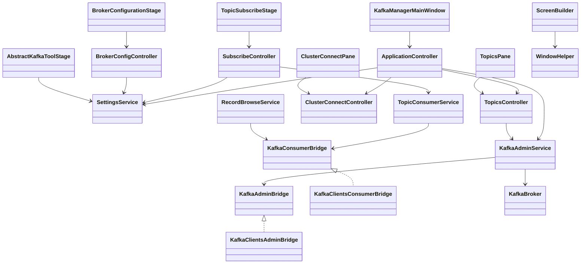

# Kafka Tool — Architecture

Last updated: 2026-06-26

## Overview

Kafka Tool is a single-process JavaFX desktop application using an **MVC-style** layout: views (panes, stages, controls) bind to controllers; controllers orchestrate services in `inspect/`, `consumers/`, and `settings/`. One `KafkaAdminService` instance manages the broker connection for the app lifetime.

**Domain language:** see **`docs/DOMAIN.md`** (read before any change; update when terminology shifts).

```
┌─────────────────────────────────────────────────────────────────────────┐
│ KafkaManagerMainWindow → ApplicationController                          │
│   ClusterConnectPane → ClusterConnectController                         │
│   ClusterMonitorPane → ClusterMonitorController                           │
│   TopicsPane → TopicsController → TopicSubscribeStage / RecordBrowseStage │
│   ConsumerGroupsPane → ConsumerGroupsController                           │
│   BrokerConfigurationStage → BrokerConfigController                     │
└─────────────────────────────────────────────────────────────────────────┘
         │                              │
         ▼                              ▼
   SettingsService → ~/.kafka-tool/     Kafka Cluster + Schema Registry
```

## Technology stack

| Concern | Choice |
|---------|--------|
| Runtime | Java 25 |
| UI | JavaFX 25 (programmatic, undecorated windows) |
| Kafka client | Apache kafka-clients 4.3.x |
| Schema formats | Confluent serializers 8.3.x (Avro, JSON Schema, Protobuf) |
| Config persistence | Jackson JSON files in `~/.kafka-tool/` |
| Logging | SLF4J + Logback |
| Build | Maven |
| Local dev stack | Docker Compose (`resources/docker/docker-compose.yaml`, `./scripts/setup-local-env.sh`) |

## Package structure

### Root (`io.vepo.kafka.tool`)

| Class | Responsibility |
|-------|----------------|
| `KafkaManagerMainWindow` | Application entry; creates `ApplicationController`; scene chrome |
| `ClusterConnectPane` | View: broker combo, test/configure/connect |
| `ClusterMonitorPane` | View: cluster health, brokers, log dirs, partition issues |
| `TopicsPane` | View: topic list with Empty / Browse / Subscribe |
| `ConsumerGroupsPane` | View: consumer groups, members, lag table |

### `controllers/` — MVC orchestration

| Class | Responsibility |
|-------|----------------|
| `ApplicationController` | Owns `KafkaAdminService` and `SettingsService`; wires child controllers; connect/shutdown |
| `ClusterConnectController` | Broker list for connect screen; opens broker config |
| `ClusterMonitorController` | Cluster snapshot refresh, auto-refresh, navigate to topic / broker config |
| `TopicsController` | Topic list; empty topic; open subscribe/browse stages; disconnect; topic selection |
| `SubscribeController` | Live consumer lifecycle, message rows, serializer persistence |
| `RecordBrowseController` | Partition/offset fetch, browse message rows |
| `ConsumerGroupsController` | Group list, members, lag rows, auto-refresh |
| `BrokerConfigController` | Broker CRUD and connection test via `SettingsService` |
| `BrokerRuntimeConfigController` | Read-only live broker config from cluster |

Controllers may use `javafx.collections` and `Platform.runLater` for FX-thread marshalling. They must not mutate JavaFX nodes directly.

### `viewmodels/` — Presentation models

| Class | Responsibility |
|-------|----------------|
| `MessageRow` | Partition, offset, timestamp, display key/value for tables |
| `ConsumerState` | IDLE, RUNNING, STOPPED, ERROR |

### `inspect/` — Domain models and Kafka facades

| Class / package | Responsibility |
|-----------------|----------------|
| `KafkaAdminService` | Connection lifecycle, executor, watchers; delegates I/O to `KafkaAdminBridge` |
| `RecordBrowseService` | Partition offsets via admin bridge; record fetch via `KafkaConsumerBridge` |
| `inspect/bridge/` | `KafkaAdminBridge`, `KafkaConsumerBridge`, `SchemaRegistryBridge` interfaces |
| `inspect/bridge/impl/` | **Only layer** that constructs `AdminClient` / `KafkaConsumer` |
| `inspect/bridge/internal/` | Cluster monitor and consumer-group Admin API orchestration |
| `PartitionHealthAnalyzer` | Under-replicated, offline, leader-not-preferred detection |
| `SchemaRegistryHealthService` | Facade over `HttpSchemaRegistryBridge` |
| `TopicInfo`, `FetchedRecord`, `ClusterSummary`, … | Inspection DTOs |
| `ConnectionResult` | Connect/test connection outcome |

### `consumers/` — Consumption helpers

| Class | Responsibility |
|-------|----------------|
| `TopicConsumerService` | Live consumer executor; delegates to `KafkaConsumerBridge` |
| `RecordValueFormatter` | Deserialized value → display string |
| `KeyFormatter` | Key byte → display string |
| `ProtobufHelper` | Protobuf message → JSON |
| `AgnosticConsumerException` | Unchecked wrapper for consumer failures |

### `settings/` — Persistence

| Class | Responsibility |
|-------|----------------|
| `Settings` | Internal static load/save; single-thread `saveExecutor` |
| `SettingsService` | Injectable facade used by controllers (not views) |
| `KafkaSettings` / `KafkaBroker` | Saved broker profiles |
| `UiSettings` / `WindowSettings` | Window dimensions |
| `SerializerSettings` | Per-topic key/value serializer choices |

Config directory: `~/.kafka-tool/`

| File | Content |
|------|---------|
| `kafka-properties.json` | Broker list |
| `ui-properties.json` | Main window + dialog sizes |
| `serializers.json` | Per-topic serializer preferences |

### `stages/` — Secondary window views

| Class | Responsibility |
|-------|----------------|
| `AbstractKafkaToolStage` | Undecorated stage setup, dialog size via `SettingsService` |
| `BrokerConfigurationStage` | Broker table + add form (view only) |
| `BrokerRuntimeConfigStage` | Read-only broker runtime configuration from cluster |
| `TopicSubscribeStage` | Live subscribe UI bound to `SubscribeController` |
| `RecordBrowseStage` | Partition/offset browse UI bound to `RecordBrowseController` |
| `MessageViewerStage` | Read-only formatted message view |

### `controls/` — Reusable UI

| Area | Key types |
|------|-----------|
| Layout | `MainWindowPane`, `CentralizedPane`, `EmptyStatePane`, `ProgressStatusBar`, `WindowHead`, `TopicConsumerStatusBar` |
| Builders | `UI`, `TableBuilder`, `ScreenBuilder`, `ResizePolicy` |
| Helpers | `WindowHelper`, `ResizeHelper`, `ViewHeader`, `UserConfirmation` |

UI catalog: **`docs/UI_COMPONENTS.md`** (keep in sync when adding controls).

## Layer rules

| Layer | May call | Must not |
|-------|----------|----------|
| Views (`controls/`, `stages/`, root panes) | `controllers/`, `viewmodels/` | `inspect/`, `consumers/`, `Settings` directly |
| `controllers/` | `KafkaAdminService`, `SettingsService`, `viewmodels/` | JavaFX node mutation; `org.apache.kafka.clients.*` |
| `KafkaAdminService`, `RecordBrowseService`, `TopicConsumerService` | `inspect/bridge/*` interfaces | `AdminClient`, `KafkaConsumer` |
| `inspect/bridge/impl/`, `inspect/bridge/internal/` | kafka-clients, Confluent deserializers | JavaFX |
| `inspect/` (domain), `consumers/` (formatters), `settings/` | Jackson, filesystem, Kafka metadata types for analysis | JavaFX; client construction |

## Data flows

### 1. Application startup

1. `main()` → `Application.launch()`
2. `ApplicationController` creates `KafkaAdminService`, `SettingsService`, child controllers
3. Show `ClusterConnectPane` inside `WindowHelper.rootControl()`
4. Restore window size from `SettingsService.ui()`

### 2. Broker connect

```
ClusterConnectPane [Connect]
  → ClusterConnectController.connect(broker)
  → ApplicationController → KafkaAdminService.connect()  [admin executor]
    → KafkaAdminBridge.connect(bootstrapServers)
    → connection listener → Platform.runLater: swap to MainWindowPane
    → TopicsController.refreshTopics()
```

### 3. Topic listing

```
TopicsPane [Refresh]
  → TopicsController.refreshTopics()
  → KafkaAdminService.listTopics()  [admin executor]
    → Platform.runLater: update ObservableList<TopicInfo>
```

### 4. Subscribe and consume (live)

```
TopicsPane [Subscribe]
  → TopicsController.openSubscribe()
  → ApplicationController → SubscribeController + TopicSubscribeStage
  → User selects serializers (persisted via SettingsService)
  → [Start] → SubscribeController → TopicConsumerService.start()
    → blocking poll on consumer executor
    → each record: Platform.runLater → MessageRow in ObservableList
  → [Stop] → TopicConsumerService.stop()
  → stage close: TopicConsumerService.close()
```

Key display uses `KeyFormatter` in the service layer, not Kafka key deserializers.

### 5. Browse records by partition/offset

```
TopicsPane [Browse]
  → RecordBrowseController + RecordBrowseStage
  → RecordBrowseService.describeTopicPartitions()
  → [Fetch] → KafkaConsumerBridge.fetchRecords → MessageRow table
```

### 6. Consumer group lag

```
ConsumerGroupsPane
  → ConsumerGroupsController.refreshGroups()
  → KafkaAdminService.listConsumerGroups / computeConsumerGroupLag
  → members table + PartitionLagRow lag table (optional 5s auto-refresh)
```

### 7. Settings persistence

Views and controllers write via `SettingsService` → internal `Settings` static methods → `saveExecutor` → JSON files.

## Threading model

| Thread | Work |
|--------|------|
| JavaFX Application Thread | All UI creation and mutation |
| `KafkaAdminService` executor (single) | Kafka admin bridge operations |
| `Settings.saveExecutor` (single) | JSON file writes |
| `TopicConsumerService` executor (single) | Blocking consumer poll loop |

**Rule:** Controllers marshal Kafka/service callbacks with `Platform.runLater` before updating observable state bound by views.

## External integration

### Kafka Admin / Consumer API

All client construction lives in `inspect/bridge/impl/`. Facades (`KafkaAdminService`, `TopicConsumerService`, `RecordBrowseService`) call bridge interfaces only.

### Integration tests

Bridge implementations are verified with **Testcontainers** (Kafka + Schema Registry). Run `mvn verify -Dkafka.integration=true`. Unit tests exclude `@Tag("integration")` by default.

### Confluent Schema Registry

Required for Avro and Protobuf; optional for JSON Schema. URL from `KafkaBroker.schemaRegistryUrl`. When absent, `TopicConsumerService` limits value serializer to JSON only.

### Local development stack

`resources/docker/docker-compose.yaml` (started via `./scripts/setup-local-env.sh`):

| Service | Image | Host port |
|---------|-------|-----------|
| Kafka | `vepo/kafka:latest` (KRaft) × 3 | 29092, 29093, 29094 |
| Schema Registry | `confluentinc/cp-schema-registry:8.3.0` | 8081 |
| Demo records producer | `jbangdev/jbang` (profile `demo`) | — |
| Demo records consumers | `jbangdev/jbang` × 6 (JSON/Protobuf/Avro) | — |
| Economic index producer | `jbangdev/jbang` (profile `demo`) | — |
| Economic index consumers | `jbangdev/jbang` × 6 (2 per index topic) | — |
| CPI window stream | `jbangdev/jbang` Kafka Streams | — |
| Windowed CPI consumers | `jbangdev/jbang` × 2 on `economic-cpi-1m-avg` | — |

Demo profile (`./scripts/setup-local-env.sh up`) runs a **3-broker** cluster (RF 3). JBang scripts under `scripts/` run in containers via `jbangdev/jbang:latest`. Demo producers feed `users`, `person`, and `user-avro` with paired consumers; World Bank data fills `economic-cpi`, `economic-gdp`, and `economic-unemployment`. `stream-economic-windows` writes 1-minute tumbling CPI averages to `economic-cpi-1m-avg`.

Example broker profile: bootstrap `localhost:29092,localhost:29093,localhost:29094`, registry `http://localhost:8081`.

## Build artifacts

| Output | Description |
|--------|-------------|
| `target/kafka-tool.jar` | Application jar |
| `target/kafka-tool-full.jar` | Fat jar with dependencies |
| `target/libs/` | Copied dependencies |
| MSI (CI tags only) | Windows installer via jpackage (`-Pjpackage-windows`) |
| DEB (CI tags only) | Linux installer via jpackage (`-Pjpackage-linux`) |

## Known gaps and caveats

- **Consumers tab** is a placeholder.
- **Plain Text** format is documented in README but not implemented.
- Consumer `stop()` does not call `KafkaConsumer.wakeup()` — stop may wait up to poll timeout.
- `KafkaAdminService.close()` does not shut down its executor.
- Message viewer assumes JSON-parseable values (Avro `toString()` may not parse).
- One shared admin client; reconnect overwrites without explicit disconnect UI.

## Class diagram



## When to update this document

Update `docs/ARCHITECTURE.md` when a change:

- Adds, removes, or renames a package or major class
- Introduces a new data flow (e.g. producer, new admin action)
- Changes threading, persistence location, or connection model
- Adds/removes an external dependency or integration point
- Alters layer boundaries (what may call what)

Keep **Last updated** date current. Mirror critical changes in `AGENTS.md` if agent workflow is affected.
