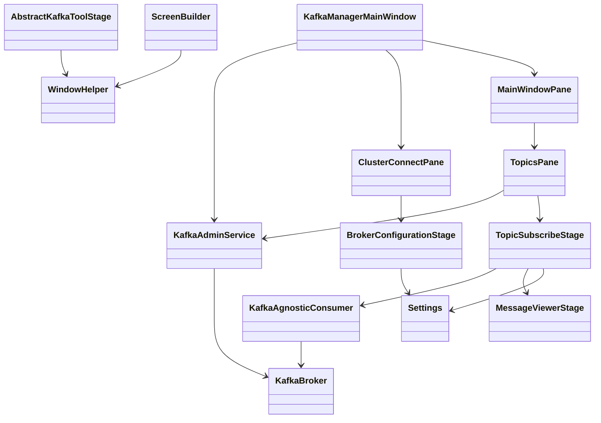

# Kafka Tool — Architecture

Last updated: 2026-06-25

## Overview

Kafka Tool is a single-process JavaFX desktop application. One `KafkaAdminService` instance manages the broker connection for the app lifetime. Users connect to a saved broker profile, browse topics, subscribe with format-specific consumers, and perform admin actions (empty topic).

```
┌──────────────────────────────────────────────────────────────┐
│                    KafkaManagerMainWindow                    │
│  ClusterConnectPane ──connect──► KafkaAdminService           │
│  MainWindowPane ──► TopicsPane ──► TopicSubscribeStage       │
└──────────────────────────────────────────────────────────────┘
         │                              │
         ▼                              ▼
   Settings (~/.kafka-tool/)     Kafka Cluster + Schema Registry
```

## Technology stack

| Concern | Choice |
|---------|--------|
| Runtime | Java 25 |
| UI | JavaFX 25 (programmatic, undecorated windows) |
| Kafka client | Apache kafka-clients 4.3.x |
| Schema formats | Confluent serializers 8.3.x (Avro, JSON Schema, Protobuf) |
| Config persistence | Jackson JSON files in `~/.kafka-tool/` |
| Logging | SLF4J + Logback |
| Build | Maven |
| Local dev stack | Docker Compose (`resources/docker/docker-compose.yaml`, `./scripts/setup-local-env.sh`) |

## Package structure

### Root (`io.vepo.kafka.tool`)

| Class | Responsibility |
|-------|----------------|
| `KafkaManagerMainWindow` | Application entry; owns `KafkaAdminService`; switches from connect screen to main tabs |
| `ClusterConnectPane` | Broker selection, opens `BrokerConfigurationStage`, triggers connect |
| `TopicsPane` | Topic list with Empty / Subscribe actions; watches connection status |

### `inspect/` — Admin API and domain models

| Class | Responsibility |
|-------|----------------|
| `KafkaAdminService` | Single-thread executor; `AdminClient` lifecycle; list topics, empty topic |
| `TopicInfo` | Topic name + internal flag |
| `KafkaMessage` | Table row: raw key bytes + deserialized value string |
| `MessageMetadata` | Offset metadata from consumer callback |

**Admin empty-topic flow:** `describeTopics` → `allTopicNames()` → `listOffsets(latest)` → `deleteRecords(beforeOffset)`.

### `consumers/` — Topic consumption

| Class | Responsibility |
|-------|----------------|
| `KafkaAgnosticConsumer` | Factory + shared poll loop for Avro, JSON, Protobuf |
| `AgnosticConsumerException` | Unchecked wrapper for consumer failures |

Each implementation creates a `KafkaConsumer<byte[], R>` with:
- Random group id (`random-{uuid}`)
- `auto.offset.reset=earliest`
- `ByteArrayDeserializer` for keys
- Confluent value deserializer + `schema.registry.url` from broker

Blocking poll runs on the caller's executor thread until `stop()` clears the running flag.

### `settings/` — Persistence

| Class | Responsibility |
|-------|----------------|
| `Settings` | Load/save facade; single-thread `saveExecutor` |
| `KafkaSettings` / `KafkaBroker` | Saved broker profiles |
| `UiSettings` / `WindowSettings` | Window dimensions |
| `SerializerSettings` | Per-topic key/value serializer choices |
| `KeySerializer`, `ValueSerializer` | Enums for UI combos |

Config directory: `~/.kafka-tool/`

| File | Content |
|------|---------|
| `kafka-properties.json` | Broker list |
| `ui-properties.json` | Main window + dialog sizes |
| `serializers.json` | Per-topic serializer preferences |

### `stages/` — Secondary windows

| Class | Responsibility |
|-------|----------------|
| `AbstractKafkaToolStage` | Undecorated stage setup, dialog size persistence, custom title bar |
| `BrokerConfigurationStage` | CRUD for broker profiles |
| `TopicSubscribeStage` | Start/stop consumer, message table, serializer combos |
| `MessageViewerStage` | Read-only formatted message view |

### `controls/` — Reusable UI

| Area | Key types |
|------|-----------|
| Layout | `MainWindowPane`, `CentralizedPane`, `WindowHead`, `TopicConsumerStatusBar` |
| Builders | `ScreenBuilder`, `ResizePolicy` |
| Helpers | `WindowHelper`, `ResizeHelper`, `ProtobufHelper` |

## Data flows

### 1. Application startup

1. `main()` → `Application.launch()`
2. Create `KafkaAdminService`, `MainWindowPane` (Topics tab), `ClusterConnectPane`
3. Show connect pane inside `WindowHelper.rootControl()`
4. Restore window size from `Settings.ui()`

### 2. Broker connect

```
ClusterConnectPane [Connect]
  → KafkaAdminService.connect(broker, callback)  [admin executor]
    → AdminClient.create(bootstrapServers)
    → status = CONNECTED
    → callback on executor thread
      → Platform.runLater: swap to MainWindowPane, update title
    → notify KafkaConnectionWatcher(s) → TopicsPane.reload()
```

Connect does not probe broker health; success means `AdminClient` was created.

### 3. Topic listing

```
TopicsPane.reload()
  → KafkaAdminService.listTopics(callback)  [admin executor]
    → adminClient.listTopics()
    → map to List<TopicInfo>
    → Platform.runLater: update ListView
```

### 4. Subscribe and consume

```
TopicsPane [Subscribe]
  → new TopicSubscribeStage(topic, owner, connectedBroker)
  → User selects serializers (persisted via Settings)
  → [Start] → consumerExecutor.submit(consumer.start(...))
    → blocking poll loop on consumerExecutor
    → each record: Platform.runLater → add KafkaMessage to TableView
  → [Stop] → consumer.stop() (flag only; no consumer.wakeup())
  → stage close: stop consumer, shutdown executor
```

Key display is decoded in the UI layer (String or big-endian int from 4 bytes), not via Kafka key deserializers.

### 5. Settings persistence

All writes: read current → apply mutation → Jackson write, serialized on `saveExecutor`.

Reads are synchronous on first access (`loadProperties`).

## Threading model

| Thread | Work |
|--------|------|
| JavaFX Application Thread | All UI creation and mutation |
| `KafkaAdminService` executor (single) | AdminClient operations |
| `Settings.saveExecutor` (single) | JSON file writes |
| `TopicSubscribeStage.consumerExecutor` (single) | Blocking consumer poll loop |

**Rule:** Kafka callbacks and executor tasks must use `Platform.runLater` before touching JavaFX nodes.

## External integration

### Kafka Admin API

Used for: list topics, describe topic, list offsets, delete records.

### Kafka Consumer API

Used for: subscribe + poll in `KafkaAgnosticConsumer` implementations.

### Confluent Schema Registry

Required for Avro and Protobuf; optional for JSON Schema. URL from `KafkaBroker.schemaRegistryUrl`. When absent, UI limits value serializer to JSON only.

### Local development stack

`resources/docker/docker-compose.yaml` (started via `./scripts/setup-local-env.sh`):

| Service | Image | Host port |
|---------|-------|-----------|
| Kafka | `vepo/kafka:latest` (KRaft) | 29092 |
| Schema Registry | `confluentinc/cp-schema-registry:8.3.0` | 8081 |

Example broker profile: bootstrap `localhost:29092`, registry `http://localhost:8081`.

## Build artifacts

| Output | Description |
|--------|-------------|
| `target/kafka-tool.jar` | Application jar |
| `target/kafka-tool-full.jar` | Fat jar with dependencies |
| `target/libs/` | Copied dependencies |
| MSI (CI tags only) | Windows installer via jpackage |

## Known gaps and caveats

- **Consumers tab** is a placeholder.
- **Plain Text** format is documented in README but not implemented.
- Consumer `stop()` does not call `KafkaConsumer.wakeup()` — stop may wait up to poll timeout.
- `KafkaAdminService.close()` does not shut down its executor.
- Message viewer assumes JSON-parseable values (Avro `toString()` may not parse).
- One shared admin client; reconnect overwrites without explicit disconnect UI.

## Class diagram



## When to update this document

Update `docs/ARCHITECTURE.md` when a change:

- Adds, removes, or renames a package or major class
- Introduces a new data flow (e.g. producer, new admin action)
- Changes threading, persistence location, or connection model
- Adds/removes an external dependency or integration point
- Alters layer boundaries (what may call what)

Keep **Last updated** date current. Mirror critical changes in `AGENTS.md` if agent workflow is affected.
